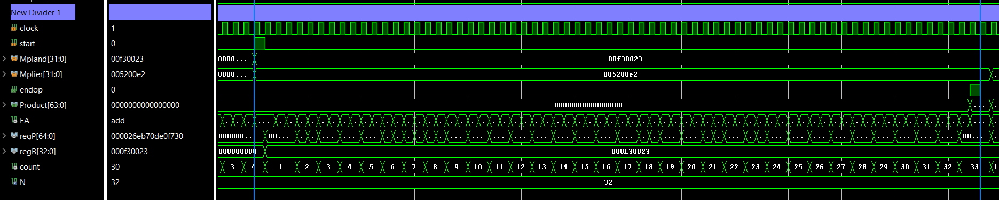
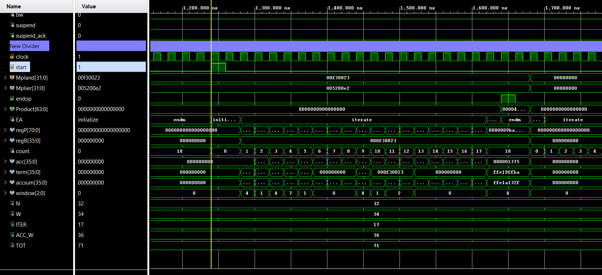

# 32-bit multipliers for MIPS_S

A Booth radix-4 multiplier for the `MULTU` instruction of the MIPS_S soft
processor, side by side with the serial multiplier it replaces, plus the
testbench and the constraint used to measure both.

The two units expose the same ports and the same handshake, so substituting
one for the other inside MIPS_S is a one-line change.

## Results

Vivado, Nexys A7-100T (`xc7a100tcsg324-1`), 10 ns clock constraint, both
units built under identical conditions. Timing figures are
post-implementation.

| | serial | Booth radix-4 |
|---|---|---|
| Bits consumed per iteration | 1 | 2 |
| Iterations | 32 | 17 |
| Latency | 67 cycles | 20 cycles |
| LUTs | 179 | 127 |
| Flip-flops | 199 | 175 |
| WNS @ 10 ns | 4.572 ns | 3.621 ns |
| Minimum period | 5.428 ns | 6.379 ns |
| **Fmax** | **184.2 MHz** | **156.8 MHz** |
| **Time per multiplication** | **363.7 ns** | **127.6 ns** |

Booth needs a clock about 15% slower, because it does the recoding, the
addition and the two-place shift inside a single cycle where the serial unit
spreads the work over two states. It still finishes in **2.85× less time**,
because it needs 20 cycles instead of 67.

Counting cycles alone would have suggested 3.35×. The gap between the two
figures is the cost of the longer critical path, which is why the timing
measurement is part of the result rather than an afterthought.

## Simulation

The testbench running in Vivado. Both units are instantiated side by side and
fed the same operands; `cyc_ser` and `cyc_bth` hold the measured latencies,
`done_ser` and `done_bth` mark each unit finishing, and `errors` stays at
zero throughout:


Each unit on its own. The serial one alternates `add` and `shift` while
`count` climbs to 32:



Booth stays in `iterate` and stops at 17, consuming two bits per cycle
through the 3-bit `window`:



## Synthesis and timing

Utilization — serial on the left, Booth on the right:

<p>


</p>

Design Timing Summary after implementation:


## Layout

```
rtl/   mult_div.vhd       serial multiplier (MIPS_S original)
       Mult_booth4.vhd    Booth radix-4 multiplier
sim/   tb_multiplier.vhd            testbench covering both units
       tb_multiplier_behav.wcfg     waveform configuration
xdc/   clk.xdc            clock constraint used for the timing runs
docs/  comparison.md      the technical write-up
```

## Reproducing the simulation

1. Create a project in Vivado and add `rtl/mult_div.vhd` and
   `rtl/Mult_booth4.vhd` as design sources.
2. Add `sim/tb_multiplier.vhd` as a simulation source and set
   `tb_multiplier` as the simulation top.
3. Run Behavioral Simulation, then type `run 100us` in the Tcl console. The
   default 1000 ns only covers the first vector.
4. Open `sim/tb_multiplier_behav.wcfg` to get the same signal grouping as the
   screenshots above.

The testbench drives both multipliers with identical stimulus and compares
each product against `unsigned(a) * unsigned(b)`, computed by the simulator
rather than by the hardware. Directed cases (zero, identity,
`0xFFFFFFFF × 0xFFFFFFFF`, MSB-only operands, alternating bit patterns) plus a
deterministic pseudo-random sweep, 76 vectors in all. Every vector prints its
operands, the product and the measured latency of both units, and the run
ends with:

```
Note: === PASS: all vectors matched the golden model ===
```

A mismatch stops the run with `severity failure` instead.

## Reproducing the timing measurement

Add `xdc/clk.xdc` to the project as a constraint. It holds one line:

```tcl
create_clock -name clock -period 10.000 [get_ports clock]
```

Without it Vivado has no clock to analyse and the Timing tab comes back
empty. Set one multiplier as top, Run Synthesis, Run Implementation, then
Reports > Timing > Report Timing Summary and read **WNS** under Setup.

```
Fmax = 1000 / (10 - WNS)          [MHz]
Time per multiplication = cycles / Fmax
```

Repeat with the other unit as top, changing nothing else — same part, same
period, same constraint file.

## Using it in MIPS_S

In `MIPS_S_Sim.vhd`, change the instantiation and nothing else:

```vhdl
-- inst_Mult: entity work.multiplier      port map (...);
   inst_Mult: entity work.multiplier_booth port map (...);
```

`start` is still driven by `rst_muldiv` and `end_mul` still gates the `Salu`
transition, so the processor's control path does not move. The MIPS_S sources
are not included here; this repository is about the multipliers.

## Attribution

`rtl/mult_div.vhd` is the MIPS_S serial multiplier by Ney Calazans and
Fernando Moraes, kept as the reference for the comparison, with its original
header and change log preserved.

`rtl/Mult_booth4.vhd`, the testbench and the documentation were produced by
Liga ProtoFPGA (UFSC) and are released under the terms in
[`LICENSE`](LICENSE), which does not extend to `mult_div.vhd`.
