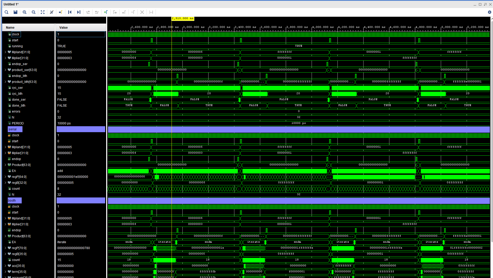
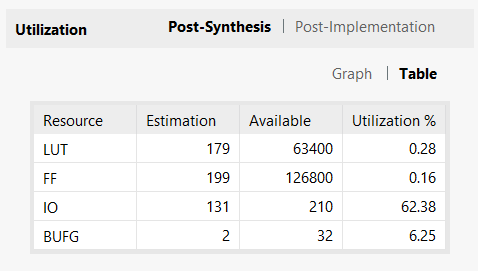
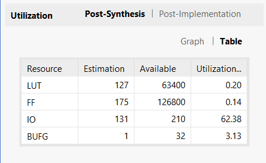
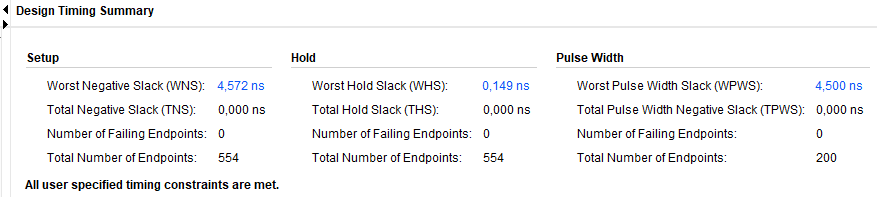
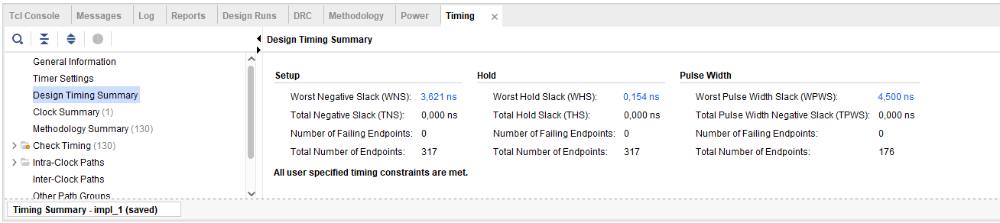

# Serial vs. Booth radix-4: 32-bit unsigned multiplication on FPGA

This note compares the two multipliers in this repository. Both compute the
same function — a 32-bit unsigned product returned in 64 bits — and both
expose the same ports and the same handshake, so either one can drive the
`MULTU` instruction of MIPS_S without touching the rest of the processor.

## 1. The two designs

### Serial (reference)

The classical shift-and-add multiplier from Hennessy & Patterson. One bit of
the multiplier is examined per iteration: if it is `1`, the multiplicand is
added to the partial accumulator; then the whole register shifts one place
right. The FSM keeps `add` and `shift` in separate states:

```
initialize -> add -> shift -> add -> shift -> ... -> finish -> endm
```

Thirty-two iterations, two states each, so the bulk of the run is 64 cycles.
A single adder is reused for every bit position: the cost of the operation is
paid in time rather than in area.

### Booth radix-4

Two bits of the multiplier are consumed per iteration. A sliding 3-bit
window `(b[2j+1], b[2j], b[2j-1])` selects one of five partial terms:

| window | term |
|--------|------|
| `000`  | 0    |
| `001`  | +M   |
| `010`  | +M   |
| `011`  | +2M  |
| `100`  | -2M  |
| `101`  | -M   |
| `110`  | -M   |
| `111`  | 0    |

None of these five options needs a multiplier. `+2M` is `M << 1`, which on an
FPGA is routing rather than logic; `-M` and `-2M` are two's-complement
negations of the same operands.

Two things then happen in the *same* clock cycle: the selected term is added
to the accumulator, and the combined 71-bit register is shifted two places
right, arithmetically. Merging them is what removes the separate `shift`
state:

```
initialize -> iterate -> iterate -> ... -> finish -> endm
```

`W = N + 2 = 34`, so `ITER = W/2 = 17` iterations.

### Unsigned operands, signed arithmetic

`MULTU` is unsigned, Booth recoding is not. Both operands are zero-extended
so they are positive in two's complement, and the accumulator carries two
bits of slack. The negative terms are internal to the recoding — they do not
make the instruction signed. This is worth stating explicitly, because "the
datapath is `signed`" is easy to misread as "this is no longer `MULTU`".

## 2. Functional verification

The multiplier was first validated inside MIPS_S, running the program that
exercises all supported instructions, which showed identical `HI`/`LO`
contents and a shorter run. That is an integration test: it proves the unit
behaves correctly in the position it occupies in the processor.

It does not, however, choose its operands. Whatever values that program
happens to multiply are the only ones exercised, and they are small. The
testbench in `sim/` covers what the integration run cannot reach: both units
receive identical stimulus, and each product is checked against
`unsigned(a) * unsigned(b)` evaluated by the simulator, which is independent
of the RTL under test.

The 76 vectors include the cases where a Booth implementation typically
breaks — `0xFFFFFFFF × 0xFFFFFFFF`, operands with only the most significant
bit set, alternating bit patterns — precisely because the recoding produces
negative partial terms while the instruction is unsigned. All 76 match on
both units.



In the waveform above, the top group holds the testbench signals — the shared
`Mpland`/`Mplier` stimulus, the two captured products, and `errors` sitting
at zero — while the two groups below it show the internal state of each unit
under the same operands. `done_ser` and `done_bth` change at visibly
different times, which is the latency difference made directly observable.

The same run measures latency, counting rising clock edges from the release
of `start` up to and including the edge on which `endop` is observed high.
The result is constant across every vector: neither unit is data-dependent.

| | serial | Booth radix-4 |
|---|---|---|
| Algorithmic iterations | 32 | 17 |
| States per iteration | `add` + `shift` | `iterate` |
| Measured latency | 67 cycles | 20 cycles |

Cycle counts get quoted loosely, so it is worth separating the figures. For
Booth, **17** is the number of algorithmic iterations and follows directly
from `ITER = W/2` in the RTL. **18–19** is what reading the FSM on paper
gives, depending on whether the `initialize` load and the `finish` cycle are
counted. **20** is the measurement, under the convention above — the interval
during which MIPS_S sits in `Salu` waiting for `end_mul`, which is the number
that matters when budgeting cycles inside the processor.

## 3. Area

Vivado synthesis, Nexys A7-100T:

<p>


</p>

| Resource | serial | Booth radix-4 | Change |
|---|---|---|---|
| LUTs | 179 | 127 | −29.1% |
| Flip-flops | 199 | 175 | −12.1% |
| I/Os | 131 | 131 | — |

The I/O count is identical because the interface is: `clock`, `start`, two
32-bit operands, `endop`, and a 64-bit product — 131 pins either way.

**The LUT result runs against intuition**, and that is what makes it worth
explaining. Booth adds a 5-to-1 recoding multiplexer the serial design does
not have, and its `regP` is *wider* — 71 bits against 65. It still comes out
smaller. The saving is not in the datapath, it is in the control:

- the `shift` state disappears, so the FSM has four states instead of five;
- 17 iterations instead of 32, so the counter spans a smaller range;
- the `×2` terms are wiring, not arithmetic.

The counter deserves a caveat. The Booth RTL declares it as
`integer range 0 to ITER+1`, which lets the synthesiser infer five bits,
while the serial unit uses an unbounded `integer`, which infers 32. That is a
difference in RTL style, not in the algorithm, and it accounts for part of
the flip-flop gap. Bounding the range in the serial unit and re-synthesising
would narrow it; that is the obvious next control experiment.

One further caveat: these numbers come from an ordinary synthesis run, so the
tool inserted I/O buffers for all 131 pins and some of the reported logic is
pad-related rather than multiplier logic. Both units were built the same way,
so the comparison holds, but the absolute figures are not the multiplier
alone.

## 4. Timing

Fewer cycles is not the same as more speed. Booth concentrates far more
combinational logic into one iteration:

```
regP -> window -> Booth decoder -> mux -> add/subtract -> shift -> regP
```

The serial unit splits the addition and the shift across two clock cycles, so
its critical path is shorter and it should close timing at a higher
frequency. Measurement confirms it.

Both units were constrained with the same single line, in `xdc/clk.xdc`:

```tcl
create_clock -name clock -period 10.000 [get_ports clock]
```

Design Timing Summary after implementation — serial first, then Booth:





| | serial | Booth radix-4 |
|---|---|---|
| WNS, post-synthesis | 6.276 ns | 4.427 ns |
| WNS, post-implementation | 4.572 ns | 3.621 ns |
| Minimum period | 5.428 ns | 6.379 ns |
| Fmax | 184.2 MHz | 156.8 MHz |

Both met the 10 ns constraint with positive slack, so `Fmax` follows from
`1000 / (period − WNS)`. The post-implementation figures are the ones quoted;
the post-synthesis values are estimates taken before placement and routing.

Booth is about 15% slower per cycle, as predicted. Combining the two
measurements:

| | serial | Booth radix-4 |
|---|---|---|
| Cycles | 67 | 20 |
| Period | 5.428 ns | 6.379 ns |
| **Time per multiplication** | **363.7 ns** | **127.6 ns** |

**Booth is 2.85× faster**, not the 3.35× that the cycle ratio alone suggests.
The difference between the two numbers is exactly the price of the longer
critical path.

### Which figure applies inside MIPS_S

The 2.85× holds when the multiplier is free to run at its own clock. Inside
MIPS_S it is not: the processor has a single clock, set by the slowest path
in the whole design. If the multiplier is not that path, the frequency does
not change when the unit is swapped, and the observed gain returns to the
full 3.35× cycle ratio.

Read that way, the 156.8 MHz figure is not a penalty but evidence: it shows
the Booth unit does not become the critical path of MIPS_S on this board,
which runs nowhere near that frequency.

## 5. Integration with MIPS_S

`multiplier_booth` is a drop-in replacement. In `MIPS_S_Sim.vhd` the
instantiation

```vhdl
inst_Mult: entity work.multiplier port map (...);
```

becomes

```vhdl
inst_Mult: entity work.multiplier_booth port map (...);
```

with the port map unchanged. `start` is still driven by `rst_muldiv`, and
`end_mul` still gates the `whilo`/`Salu` transition, so the control path in
the processor does not move.

The effect on real programs is proportional to how often `MULTU` executes.
Cutting the instruction from 67 cycles to 20 is a large change to that
instruction and a small change to a program that rarely uses it, which is
worth saying plainly rather than reporting the module-level speedup as if it
were a processor-level one.

The divider is untouched and still takes its original 67 cycles. Applying the
same treatment to `DIVU` is the natural follow-up.

## 6. Summary

| | serial | Booth radix-4 |
|---|---|---|
| LUTs | 179 | 127 |
| Flip-flops | 199 | 175 |
| Fmax | 184.2 MHz | 156.8 MHz |
| Cycles | 67 | 20 |
| Time per multiplication | 363.7 ns | 127.6 ns |

Booth radix-4 costs less area, runs at a lower clock, and finishes sooner.
For the multiplier unit of MIPS_S it is the better choice on every axis that
was measured except maximum frequency, and that one does not bind at the
frequencies this processor actually runs at.
